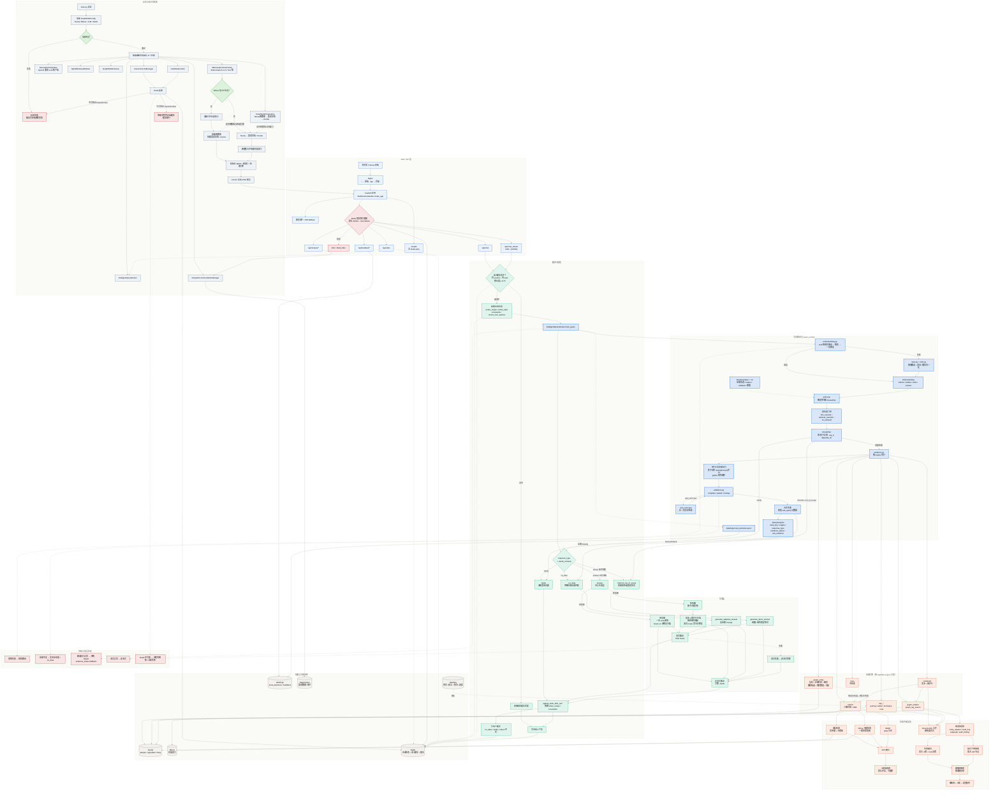

# cookwise-ai

```mermaid
flowchart TD

    %% ==================== 启动与知识库 ====================
    subgraph BOOT["启动与知识库准备"]
        START["main.py 启动"] --> CONFIG["加载 GraphRAGConfig<br/>Neo4j / Milvus / LLM / Redis"]
        CONFIG --> DEP_CHECK{"依赖检查"}
        DEP_CHECK -->|失败| BOOT_FAIL["启动失败<br/>输出具体依赖检查项"]
        DEP_CHECK -->|通过| INIT["按依赖顺序初始化 8 个步骤"]

        INIT --> DATA["GraphDataPreparation<br/>Neo4j 图数据 → 菜谱文档 → chunks"]
        INIT --> INDEX["MilvusIndexConstruction<br/>BGE-small-zh-v1.5 / 512 维"]
        INIT --> GEN_MOD["GenerationIntegration<br/>OpenAI 兼容 LLM 客户端"]
        INIT --> HYBRID["HybridRetrievalModule"]
        INIT --> GRAPH["GraphRAGRetrieval"]
        INIT --> ROUTER["IntelligentQueryRouter"]
        INIT --> CACHE["SessionCacheManager"]
        INIT --> LIMITER["RedisRateLimiter"]
        INIT --> RECIPE["RecipeRecommendationManager"]

        INDEX --> KB_CHECK{"Milvus 集合已存在？"}
        KB_CHECK -->|是| LOAD_KB["加载已有向量集合"]
        KB_CHECK -->|否| BUILD_DATA["Neo4j → 菜谱文档 / chunks"]
        LOAD_KB --> LOAD_DATA["加载图数据<br/>构建菜谱文档 / chunks"]
        LOAD_KB -.->|加载失败则重建| BUILD_DATA
        BUILD_DATA --> BUILD_VEC["新建集合并构建向量索引"]
        LOAD_DATA --> READY["初始化 BM25 / 图索引 / 检索引擎"]
        BUILD_VEC --> READY
        DATA -.->|提供图数据/文档能力| LOAD_DATA
        DATA -.->|提供图数据/文档能力| BUILD_DATA
        READY --> APP["uvicorn 启动 ASGI 服务"]

        CACHE --> REDIS_CONN["Redis 连接"]
        LIMITER --> REDIS_CONN
        REDIS_CONN -->|不可用且 required=false| MEM_FALLBACK["降级进程内会话/缓存<br/>限流放行"]
        REDIS_CONN -->|不可用且 required=true| BOOT_FAIL
    end

    %% ==================== Web / API ====================
    subgraph WEB["Web / API 层"]
        CLIENT["浏览器 / Next.js 前端"] --> NGINX["Nginx<br/>/ → 前端 · /api → 后端"]
        APP --> API["FastAPI 应用<br/>WebServiceHandler.create_app"]
        NGINX --> API
        API --> HEALTH["/health<br/>含 Redis ping"]
        API --> STATIC["静态文件 / SPA fallback"]
        API --> LIMIT{"Redis 固定窗口限流<br/>默认 60/min · chat 30/min"}
        LIMIT -->|超限| TOO_MANY["429 + Retry-After"]
        LIMIT --> CHAT_API["/api/chat"]
        LIMIT --> STREAM_API["/api/chat_stream<br/>SSE + [DONE]"]
        LIMIT --> RECIPE_API["/api/recipes/*"]
        LIMIT --> STATS_API["/api/stats"]
        LIMIT --> FEEDBACK_API["/api/feedback*"]
    end

    %% ==================== 聊天主流程 ====================
    subgraph CHATFLOW["聊天主流程"]
        CACHE_CHECK{"语义缓存命中？<br/>同 session · 同 topic<br/>相似度 ≥ 0.75"}
        CACHED["直接返回缓存答案"]
        STATE["读取会话状态<br/>active_recipe / active_topic<br/>constraints / recent_user_queries"]
        ROUTE["IntelligentQueryRouter.route_query"]
        RESP{"response_type<br/>+ needs_retrieval"}
        CLARIFY["clarify<br/>返回澄清问题"]
        DIRECT["chitchat / out_of_scope<br/>直接回答或固定拒识"]
        NO_DATA["no_data<br/>明确告知证据不足"]
        ANSWER["answer<br/>进入生成层"]
        UPDATE["update_state_after_turn<br/>更新 active_recipe / constraints"]
        WRITE_CACHE["写语义缓存<br/>no_data / clarify / refuse 不写"]
        WRITE_CTX["写会话上下文"]

        CHAT_API --> CACHE_CHECK
        STREAM_API --> CACHE_CHECK
        CACHE_CHECK -->|命中| CACHED
        CACHED --> WRITE_CTX
        CACHE_CHECK -->|未命中| STATE
        STATE --> ROUTE
        ROUTE --> RESP
        RESP -->|clarify| CLARIFY
        RESP -->|refuse 或不检索| DIRECT
        RESP -->|no_data| NO_DATA
        RESP -->|answer 且有证据| ANSWER
        CLARIFY --> UPDATE
        UPDATE --> WRITE_CACHE
        UPDATE --> WRITE_CTX
    end

    %% ==================== 查询路由包 ====================
    subgraph ROUTING["查询路由包 query_routing"]
        UNDERSTAND["understanding.py<br/>LLM 结构化输出 → 解析 → 一次修复"]
        RULES["rules.py + slots.py<br/>规则路由 / 追问 / 槽位归一化"]
        UNDER_OK["Understanding<br/>intents / entities / slots / context"]
        KEYS["RouteKeySpec × 12<br/>证据形态 / engine / validator / 阈值"]
        POLICY["policy.py<br/>确定性生成 RoutePlan"]
        THRESHOLD["置信度门控<br/>min_execute / retrieval_override / no_retrieval"]
        PLAN["RoutePlan<br/>单/多子计划 · top_k · depends_on"]
        EXEC["evidence.py<br/>按 engine 执行"]
        PARALLEL["单子计划直接执行<br/>多子计划 Semaphore(4) 并行<br/>gather 保持顺序"]
        VALIDATE["validators.py<br/>complete / partial / missing"]
        TEXT_RETRY["retry_hint=text<br/>补一次文本检索"]
        MERGE["合并去重<br/>保留 sub_query 元数据"]
        ANALYSIS["QueryAnalysis<br/>route_key / engine / response_type<br/>evidence_status / sub_evidence"]
        TELEMETRY["data/logs/route_decisions.jsonl"]

        ROUTE --> UNDERSTAND
        UNDERSTAND -->|成功| UNDER_OK
        UNDERSTAND -->|失败| RULES
        RULES --> UNDER_OK
        KEYS -.-> POLICY
        UNDER_OK --> POLICY
        POLICY --> THRESHOLD
        THRESHOLD --> PLAN
        PLAN -->|clarify| CLARIFY
        PLAN -->|chitchat / out_of_scope| DIRECT
        PLAN -->|需要检索| EXEC
        EXEC --> PARALLEL
        PARALLEL --> VALIDATE
        VALIDATE -->|retry_hint=text| TEXT_RETRY
        TEXT_RETRY --> VALIDATE
        VALIDATE --> MERGE
        MERGE -->|全部 missing| NO_DATA
        MERGE --> ANALYSIS
        ANALYSIS -.->|QueryAnalysis| RESP
        ROUTE -.-> TELEMETRY
    end

    %% ==================== 证据引擎 ====================
    subgraph ENGINES["证据引擎（按 SubPlan.engine 分发）"]
        GE["graph_entity<br/>食材 / 步骤时间 / 概览<br/>推荐候选 / 营养数值 / 功效"]
        GR["graph_relation<br/>graph_rag_search"]
        HY["hybrid<br/>三路召回 + RRF"]
        CO["combined<br/>文本 + 图并行"]
        TIPS["tips_*<br/>pairing / safety / technique / rule"]
        NONE["none<br/>不检索"]

        EXEC --> GE
        EXEC --> GR
        EXEC --> HY
        EXEC --> CO
        EXEC --> TIPS
        EXEC --> NONE
        GE -.->|图谱无结果，转文本兜底| HY
    end

    %% ==================== 检索内部实现 ====================
    subgraph RETRIEVAL["检索内部实现"]
        DUAL["双层检索<br/>实体级 + 主题级"]
        VECTOR["Milvus 向量检索<br/>一跳邻居增强"]
        BM25["BM25<br/>jieba 分词"]
        RRF["RRF 融合"]
        PARENT["父文档回填<br/>默认开启，可配置"]
        ROUND["Round-robin 合并<br/>图结果优先"]
        GQUERY["图查询理解<br/>entity_relation / multi_hop<br/>subgraph / path_finding"]
        MULTIHOP["多跳遍历<br/>最大 3 跳 + hub 剪枝"]
        SUBGRAPH["知识子图抽取<br/>最大 100 节点"]
        GREASON["图结构推理<br/>推理链校验"]
        RANK["图结构 + 词法 + 类型排序"]

        HY --> DUAL
        HY --> VECTOR
        HY --> BM25
        DUAL --> RRF
        VECTOR --> RRF
        BM25 --> RRF
        RRF --> PARENT
        GR --> GQUERY
        GQUERY --> MULTIHOP
        GQUERY --> SUBGRAPH
        MULTIHOP --> GREASON
        SUBGRAPH --> GREASON
        GREASON --> RANK
        CO --> HY
        CO --> GR
        CO --> ROUND
        HY --> ROUND
        GR --> ROUND
    end

    %% ==================== 生成层 ====================
    subgraph GENERATION["生成层"]
        GEN_DIRECT["generate_direct_answer<br/>闲聊 / 域外固定拒识"]
        NOEVID["generate_adaptive_answer<br/>无证据 Prompt"]
        SINGLE["单意图<br/>一次 LLM 调用<br/>howto ≥3 步修复分条"]
        SECTION["多意图<br/>按子问题分节"]
        ORDER["最多 4 路并行生成<br/>按原顺序输出<br/>流式 howto 首节先修复"]
        STREAM["流式输出<br/>SSE chunk"]
        NONSTREAM["非流式输出<br/>完整 JSON"]
        STREAM_FAIL["流式失败 → 非流式兜底"]

        DIRECT --> GEN_DIRECT
        ANSWER -->|单意图| SINGLE
        ANSWER -->|多意图| SECTION
        SECTION --> ORDER
        NO_DATA --> NOEVID
        SINGLE --> STREAM
        SINGLE --> NONSTREAM
        ORDER --> STREAM
        ORDER --> NONSTREAM
        NOEVID --> STREAM
        NOEVID --> NONSTREAM
        GEN_DIRECT --> STREAM
        GEN_DIRECT --> NONSTREAM
        STREAM -.->|失败| STREAM_FAIL
        STREAM_FAIL --> NONSTREAM
        STREAM --> UPDATE
        NONSTREAM --> UPDATE
    end

    %% ==================== 存储与可观测性 ====================
    subgraph STORAGE["存储与可观测性"]
        NEO4J_DB[("Neo4j<br/>Recipe / Ingredient / Step")]
        MILVUS_DB[("Milvus<br/>向量索引")]
        REDIS_DB[("Redis<br/>会话状态 / 语义缓存 / 限流")]
        TIPSDOC[("data/tips<br/>相克 / 安全 / 技法 / 选菜")]
        LOGS[("data/logs<br/>route_decisions / feedback")]
        DATA_FILES[("data/recipes<br/>菜谱数据 / 图片")]

        REDIS_CONN --> REDIS_DB
        GE --> NEO4J_DB
        GR --> NEO4J_DB
        HY --> NEO4J_DB
        HY --> MILVUS_DB
        VECTOR --> MILVUS_DB
        DUAL --> NEO4J_DB
        TIPSDOC -.->|解析| TIPS
        RECIPE_API --> RECIPE
        RECIPE --> DATA_FILES
        FEEDBACK_API --> LOGS
        TELEMETRY --> LOGS
        HEALTH -.-> REDIS_DB
        LIMIT --> REDIS_DB
        STATE -.-> REDIS_DB
        CACHE_CHECK -.-> REDIS_DB
        WRITE_CACHE --> REDIS_DB
        WRITE_CTX --> REDIS_DB
        STATS_API -.-> REDIS_DB
        STATS_API -.-> ROUTER
    end

    %% ==================== 降级与错误处理 ====================
    subgraph FAILOVER["降级与错误处理"]
        F_LLM["理解失败 → 规则路由"]
        F_EVID["证据不足 → 文本补检索 / no_data"]
        F_ROUTE["路由执行异常 → 传统 hybrid<br/>evidence_status=fallback"]
        F_STREAM["流式异常 → 非流式"]
        F_REDIS["Redis 不可用 → 进程内降级 / 启动失败"]
    end

    UNDERSTAND -.-> F_LLM
    VALIDATE -.-> F_EVID
    ROUTE -.-> F_ROUTE
    STREAM -.-> F_STREAM
    REDIS_CONN -.-> F_REDIS

    %% ==================== 样式 ====================
    %% 分组底板保持中性，节点用浅色填充区分阶段；连线退到背景层
    style BOOT fill:#fafaf7,stroke:#e1e0d9,stroke-width:1px,color:#52514e
    style WEB fill:#fafaf7,stroke:#e1e0d9,stroke-width:1px,color:#52514e
    style CHATFLOW fill:#fafaf7,stroke:#e1e0d9,stroke-width:1px,color:#52514e
    style ROUTING fill:#fafaf7,stroke:#e1e0d9,stroke-width:1px,color:#52514e
    style ENGINES fill:#fafaf7,stroke:#e1e0d9,stroke-width:1px,color:#52514e
    style RETRIEVAL fill:#fafaf7,stroke:#e1e0d9,stroke-width:1px,color:#52514e
    style GENERATION fill:#fafaf7,stroke:#e1e0d9,stroke-width:1px,color:#52514e
    style STORAGE fill:#fafaf7,stroke:#e1e0d9,stroke-width:1px,color:#52514e
    style FAILOVER fill:#fafaf7,stroke:#e1e0d9,stroke-width:1px,color:#52514e
    linkStyle default stroke:#9c9a92,stroke-width:1.1px

    %% 每个节点保留浅色填充；色相只表示阶段，统一低饱和，避免大色块抢文字
    classDef boot fill:#edf2f7,stroke:#64748b,stroke-width:1.4px,color:#0b0b0b
    classDef web fill:#eaf2fb,stroke:#2a78d6,stroke-width:1.4px,color:#0b0b0b
    classDef route fill:#d9e7f8,stroke:#2a78d6,stroke-width:2px,color:#0b0b0b
    classDef engine fill:#fceae3,stroke:#eb6834,stroke-width:1.4px,color:#0b0b0b
    classDef gen fill:#dff4ec,stroke:#1baf7a,stroke-width:1.4px,color:#0b0b0b
    classDef store fill:#f2f1ee,stroke:#898781,stroke-width:1.4px,color:#0b0b0b
    classDef fail fill:#f8e4e4,stroke:#d03b3b,stroke-width:1.6px,color:#0b0b0b
    classDef success fill:#ddf2dd,stroke:#0ca30c,stroke-width:1.4px,color:#0b0b0b

    class START,CONFIG,INIT,DATA,INDEX,GEN_MOD,HYBRID,GRAPH,ROUTER,CACHE,LIMITER,RECIPE,READY,APP,REDIS_CONN,LOAD_KB,LOAD_DATA,BUILD_DATA,BUILD_VEC boot
    class CLIENT,NGINX,API,HEALTH,CHAT_API,STREAM_API,RECIPE_API,STATS_API,FEEDBACK_API,STATIC web
    class LIMIT,TOO_MANY,BOOT_FAIL,MEM_FALLBACK,F_LLM,F_EVID,F_ROUTE,F_STREAM,F_REDIS fail
    class ROUTE,UNDERSTAND,RULES,UNDER_OK,KEYS,POLICY,THRESHOLD,PLAN,EXEC,PARALLEL,VALIDATE,TEXT_RETRY,MERGE,ANALYSIS,TELEMETRY route
    class GE,GR,HY,CO,TIPS,NONE,DUAL,VECTOR,BM25,RRF,PARENT,ROUND,GQUERY,MULTIHOP,SUBGRAPH,GREASON,RANK engine
    class CACHE_CHECK,CACHED,STATE,RESP,CLARIFY,DIRECT,NO_DATA,ANSWER,UPDATE,WRITE_CACHE,WRITE_CTX,GEN_DIRECT,NOEVID,SINGLE,SECTION,ORDER,STREAM,NONSTREAM,STREAM_FAIL gen
    class NEO4J_DB,MILVUS_DB,REDIS_DB,TIPSDOC,LOGS,DATA_FILES store
    class DEP_CHECK,KB_CHECK success
```
